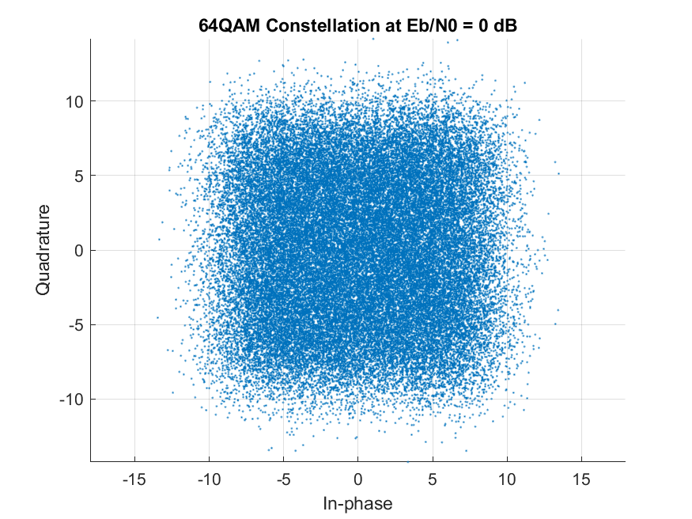
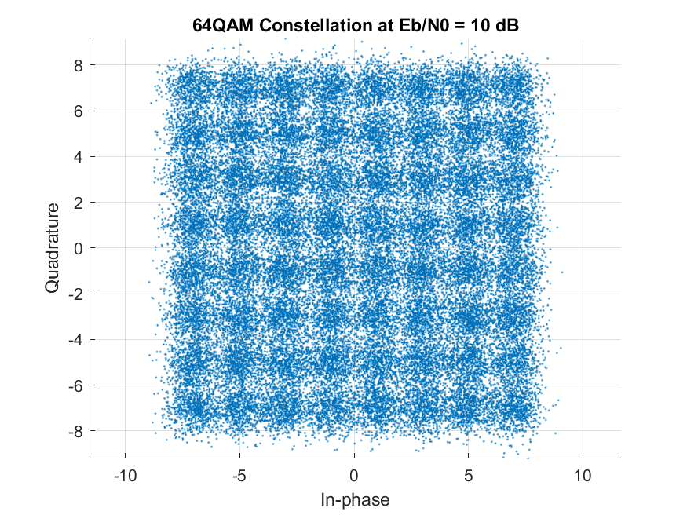
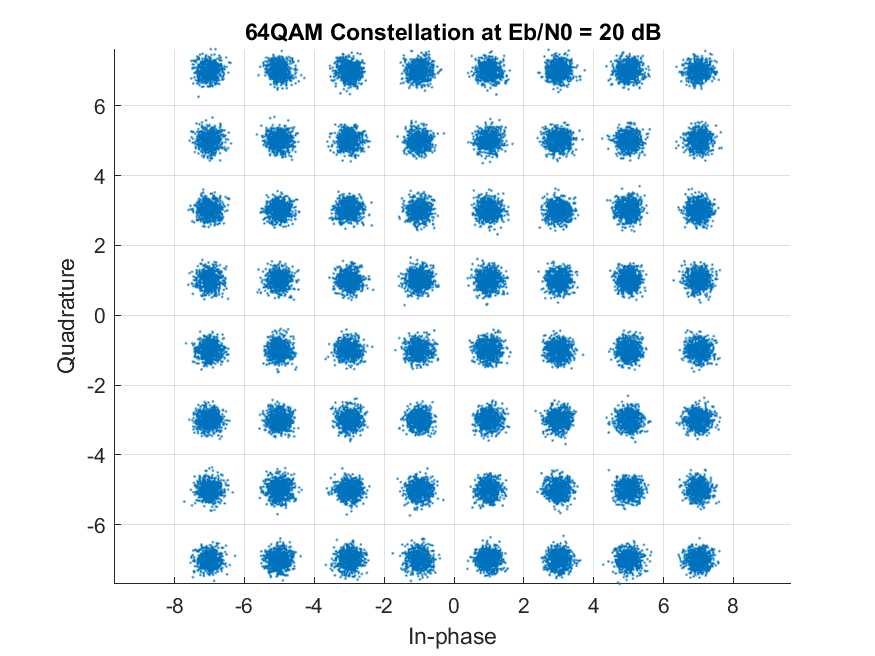
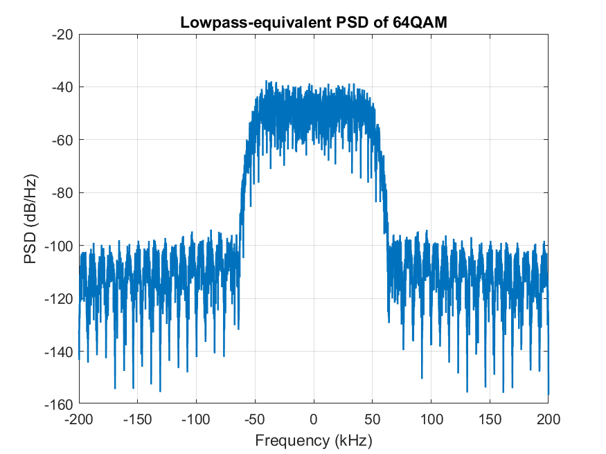
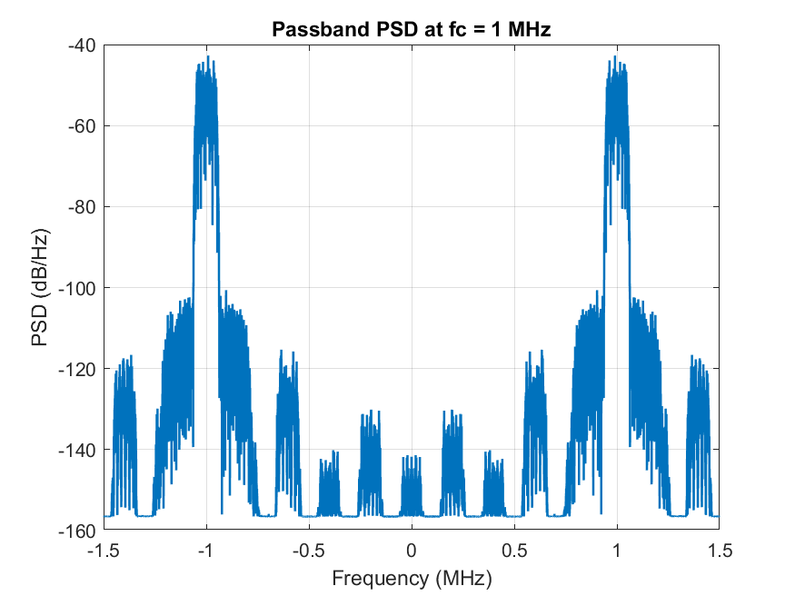
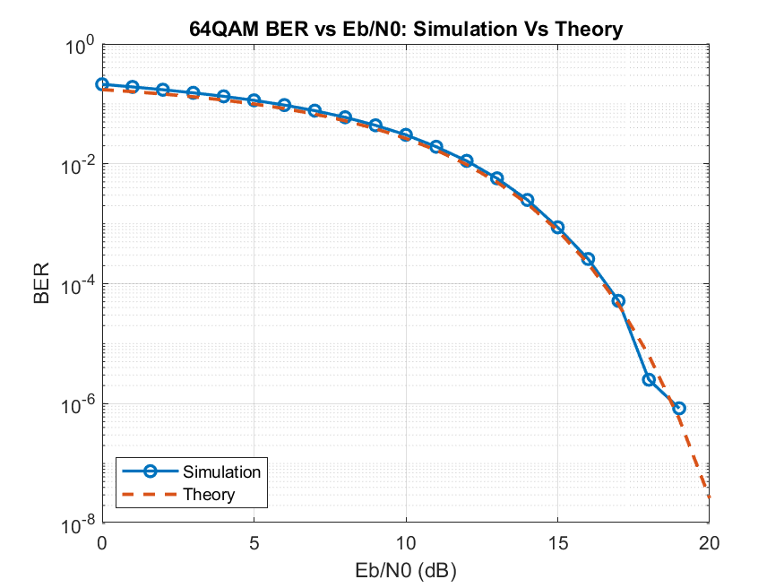

# QAM64-AWGN

64-QAM over an AWGN channel in MATLAB: constellation analysis, spectral density, BER curves, and a 16-QAM comparison.

## Structure
- `QAM64_sim.m` — main simulation script (constellations, PSD, BER sweep, 16-QAM benchmark)
- `QAM64_interactive.m` — interactive GUI with a real-time Eb/N0 slider
- `assets/` — generated figures and console logs

## Usage
```matlab
QAM64_sim
```

## Results

### 1. Constellation vs. noise
Received 64-QAM symbols as SNR increases from 0 to 20 dB:

<p align="center">
  
  
  
</p>

- **0 dB**: noise blurs points together, causing high error rates.
- **10 dB**: points begin to separate into 64 distinct clusters.
- **20 dB**: clean grid, 0 errors in simulation.

### 2. Baseband → passband
<p align="center">
  
  
</p>

- **Figure 6**: baseband spectrum centered at 0 Hz.
- **Figure 7**: same signal upconverted onto a 1 MHz carrier.

### 3. BER performance
Simulated 64-QAM BER vs. theoretical Gray-coded AWGN performance, 0–20 dB:

<p align="center">
  
</p>

### 4. 16-QAM vs. 64-QAM

```
At BER = 1.0e-03: 16QAM requires ~10.63 dB, 64QAM requires ~14.84 dB; delta = 4.20 dB (theory)
```

64-QAM carries 50% more bits/symbol than 16-QAM, at the cost of ~4.2 dB more SNR for the same BER.
